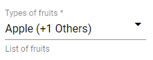

# NgxMatMSAutocomplete

Ngx Mat MultiSelect Autocomplete is a simple multiselect dropdown with master toggle and autocomplete filter, designed with angular material. [ngx-mat-msautocomplete](https://www.npmjs.com/package/ngx-mat-msautocomplete)




## What is it good for?

The library allows you to:

- Create a multiselect component with an array of objects (list) as input
- 2 way data binding with the input list. New key 'selection : boolean' will be added to each object of the input list
- Autocomplete search filter to find matching options in list, filtering in display text and if present, info text
- Master toggle to select all or clear all selection

## Dependencies

- "@angular/common": "^8.2.14",
- "@angular/core": "^8.2.14",
- "@angular/material": "^8.2.3",
- "@angular/cdk": "^8.2.3"

## Installation

- Add Angular material to your project:
    ```javascript
    $ ng add @angular/material
    ```

- Add Angular cdk to your project:
    ```javascript
    $ ng add @angular/cdk
    ```

- Install MatMSAutocomplete
    ```javascript
    $ npm i ngx-mat-msautocomplete --save
    ```

- Include ngx-mat-msautocomplete in your app.module.ts
    ```javascript
    ...
    import { NgxMatMSAutocompleteModule } from 'ngx-mat-msautocomplete';
    
    @NgModule({
      declarations: [...],
      imports: [
        ...,
        NgxMatMSAutocompleteModule
      ],
      ...
    })
    ```

- Add the selector in your component.html file:
    ```html
    <mat-ms-auto [(dropdownList)]="dropdownList" displayKey="display"></mat-ms-auto>
    ```
    
## Example

- Dropdown options - Input array of objects in TS file
    ```javascript
    fruitsList = [
      {
        info: 'This is apple',
        name: 'Apple'
      }, {
        info: 'This is orange',
        name: 'Orange'
      }, {
        info: 'This is lemon',
        name: 'Lemon'
      }, {
        info: 'This is gauva',
        name: 'Gauva'
      }, {
        info: 'This is banana',
        name: 'Banana'
      }, {
        info: 'This is kiwi',
        name: 'Kiwi'
      }
    ];
    ```

- Ngx Mat MultiSelect Autocomplete component in HTML file
    ```html
    <mat-ms-auto [(dropdownList)]="fruitsList" displayKey="name"></mat-ms-auto>
    ```

- Call method on change / selection:
    ```html
    <mat-ms-auto [(dropdownList)]="fruitsList" displayKey="name" (selectionChanged)="onChange()"></mat-ms-auto>
    ```

- Default selection:
  To select an option by default, add a key => 'selection: true' to the required option in the input array of objects:
  Example:
    ```javascript
    fruitsList = [
      {
        info: 'This is apple',
        name: 'Apple',
        selection: true
      }, {
        info: 'This is orange',
        name: 'Orange',
        selection: false
      },
      ...
    ];
    ```

## Other Options

  ```html
  <mat-ms-auto 
  name="mat-ms-auto"
  placeholder="Types of fruits"
  [(dropdownList)]="fruitsList"
  displayKey="name"
  infoKey="info"
  (selectionChanged)="onChange()"
  [masterToggle]="true"
  [alignInfoRight]="true"
  matIcon="eco"
  matHint="List of fruits"
  disabled
  required></mat-ms-auto>
  ```

Attribute | Attribute type | Default value | Description
------------ | ------------- | ------------- | -------------
placeholder | string | null | Placeholder for the input field
disabled | boolean | false | Should the input field be disabled
required | boolean | false | Is the form field required
masterToggle | boolean | true | Display 'All' checkbox to trigger master selection toggle
infoKey | string | null | Display info values for each dropdown option. Value should be a key in the input array of objects
alignInfoRight | boolean | false | Align info display to right (true) or left (false) for each dropdown option
matIcon | string | "arrow_drop_down" | ```<mat-icon>...</mat-icon>```. Value should be the material icon identifier
matHint | string | null | ```<mat-hint>...</mat-hint>```. Value should be a string
