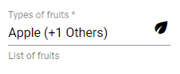
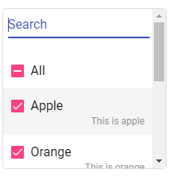
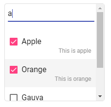

# MatMSAutocompleteLib

Mat MultiSelect Autocomplete is a simple multiselect dropdown with master toggle and autocomplete filter, designed with angular material.







## What is it good for?

The library allows you to:

- Create a multiselect component with an array of objects as input
- configuraable filter, selectall and clearall options
- Output => Input array of objects with flag: selection: boolean 

# Dependencies

- Angular CDK ^8.2.3,
- Angular Material ^8.2.3
- @material-extended/mde ^2.3.1
- material icons
- css import for material theme

## Installation

- Add Angular material to your project:
    ```javascript
    $ ng add @angular/material
    ```

- Install MatMSAutocomplete
    ```javascript
    $ npm install ngx-mat-msautocomplete
    ```
    
- Include ngx-mat-msautocomplete in your app.module.ts
    ```javascript
    import { NgxMatMSAutocompleteModule } from 'ngx-mat-msautocomplete';
    
    @NgModule({
      declarations: [...],
      imports: [
        ...,
        NgxMatMSAutocompleteModule
      ],
      ...
    })
    ```

- Add the component selector in your component.html file:
    ```html
    <mat-ms-auto [(dropdownList)]="dropdownList" displayKey="display"></mat-ms-auto>
    ```
    
## Example

- Dropdown options - Input array of objects in TS file
    ```javascript
    fruitsList = [
      {
        info: 'This is apple',
        name: 'Apple'
      }, {
        info: 'This is orange',
        name: 'Orange'
      }, {
        info: 'This is lemon',
        name: 'Lemon'
      }, {
        info: 'This is gauva',
        name: 'Gauva'
      }, {
        info: 'This is banana',
        name: 'Banana'
      }, {
        info: 'This is kiwi',
        name: 'Kiwi'
      }
    ];
    ```

- Mat Multiselect Autocomplete component in HTML file
    ```html
    <mat-ms-auto [(dropdownList)]="fruitsList" displayKey="name"></mat-ms-auto>
    ```

- Call method on change / selection:
    ```html
    <mat-ms-auto [(dropdownList)]="fruitsList" displayKey="name" (selectionChanged)="onChange()"></mat-ms-auto>
    ```

## Other Options

  ```html
  <mat-ms-auto 
  name="mat-ms-auto"
  placeholder="Types of fruits"
  [(dropdownList)]="fruitsList"
  displayKey="name"
  infoKey="info"
  (selectionChanged)="onChange()"
  [masterToggle]="true"
  [alignInfoRight]="true"
  matIcon="eco"
  matHint="List of fruits"
  disabled
  required></mat-ms-auto>
  ```

Attribute | Attribute type | Default value | Description
------------ | ------------- | ------------- | -------------
placeholder | string | null | Placeholder for the input field
disabled | boolean | false | Should the input field be disabled
required | boolean | false | Is the form field required
masterToggle | boolean | true | Display 'All' checkbox to trigger master selection toggle
infoKey | string | null | Display info values for each dropdown option. Value should be a key in the input array of objects
alignInfoRight | boolean | false | Align info display to right (default - true) or left (false) for each dropdown option
matIcon | string | null | ```html<mat-icon>...</mat-icon>```. Value should be the material icon key
matHint | string | null | ```html<mat-hint>...</mat-hint>```. Value should be hint
